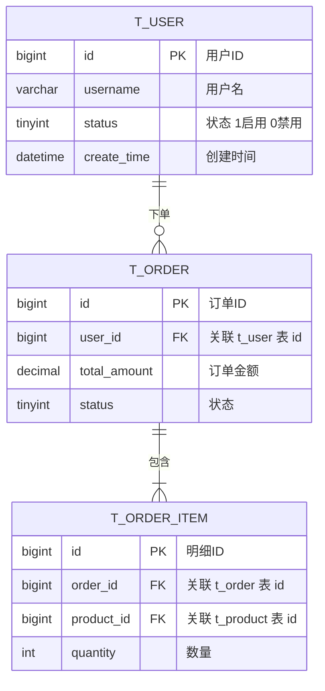

# ER 关系说明文档生成规范

**目标：** 基于已生成的 SQL 文件，生成 `ER关系图.md`，包含 Mermaid 图表和文字说明。

## 生成步骤

1. 读取 `WORK_DIR/[产品名称].sql` 提取所有表结构和字段
2. 读取 `WORK_DIR/领域模型.md` 对照聚合分组
3. 分析外键关系和业务关联（通过字段命名和注释识别）
4. 按以下格式生成 `WORK_DIR/ER关系图.md`

## ER关系图.md 格式

```markdown
# [产品名称] ER 关系图
> 生成时间：[日期]  目标数据库：[所选数据库]  总表数：[N] 张

## 一、Mermaid ER 图
> 支持在 GitHub / GitLab / Obsidian / Typora 等工具中渲染。


（按实际表数依此格式补全所有实体和关系线）

## 二、关系汇总表

| # | 主表 | 关系 | 从表 | 关联字段 | 业务含义 |
|---|------|------|------|---------|---------|
| 1 | t_user | 1:N | t_order | t_order.user_id → t_user.id | 用户可创建多笔订单 |
| 2 | t_order | 1:N | t_order_item | t_order_item.order_id → t_order.id | 订单包含多条明细 |
（按实际关系补全）

> 关系符号：1:1 一对一 / 1:N 一对多 / N:M 多对多（通过中间表）

## 三、按聚合分组说明

### [聚合名称]（[英文名]）
**聚合根：** `t_[root]`

| 表名 | 中文名 | 职责 | 与聚合根的关系 |
|------|-------|------|--------------|
| t_[root] | [中文] | [职责] | 聚合根 |
| t_[entity] | [中文] | [职责] | N:1 → t_[root] |

**关键业务规则：** [规则1] / [规则2]

---
（每个聚合重复上述格式）

## 四、跨聚合关联说明

| 关联 | 类型 | 说明 |
|------|------|------|
| t_order → t_user | 跨聚合引用 | 仅存储 ID，不做 FK 约束（跨聚合边界） |
（按实际跨聚合关联补全）

## 五、索引关系图

| 表名 | 索引名 | 字段 | 类型 | 用途 |
|------|-------|------|------|------|
| t_user | uniq_username | username | UNIQUE | 用户名唯一 |
| t_order | idx_user_id | user_id | INDEX | 按用户查订单 |
（按实际索引补全）
```

## Mermaid 关系符号速查

| 符号 | 含义 |
|------|------|
| `\|\|--\|\|` | 一对一（必须） |
| `\|\|--o\|` | 一对一（可选） |
| `\|\|--\|{` | 一对多（多端必须） |
| `\|\|--o{` | 一对多（多端可空） |
| `}o--o{` | 多对多 |

> **注意：** 字段只列 PK/FK 和核心业务字段，避免图表拥挤；中间表两端各画一对多关系。
