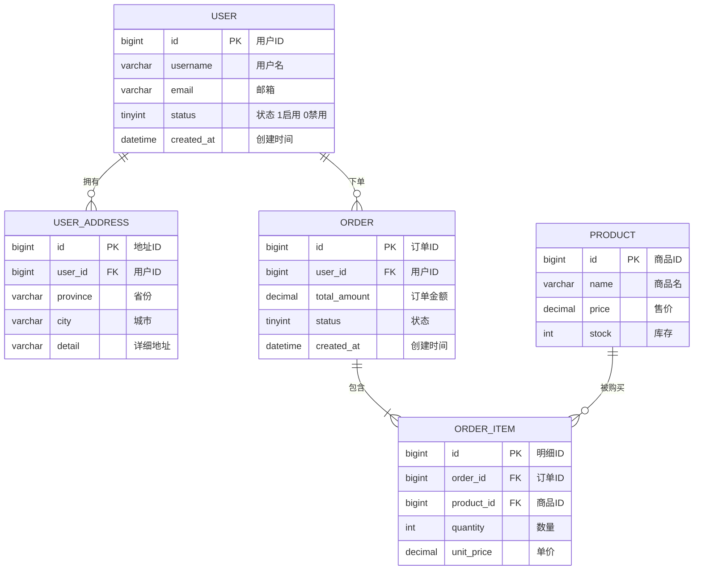

# ER 关系说明文档生成规范

**目标：** 基于已生成的 SQL 文件，生成人类可读的 ER 关系说明文档（`ER关系图.md`），包含 Mermaid 图表和文字说明。

## 生成步骤

1. 读取 `WORK_DIR/[产品名称].sql`，提取所有表结构和字段信息
2. 读取 `WORK_DIR/领域模型.md`，对照聚合分组信息
3. 分析所有外键关系和业务关联（通过字段命名规律和注释识别）
4. 按以下格式生成 `WORK_DIR/ER关系图.md`

## ER关系图.md 格式规范

```markdown
# [产品名称] ER 关系图

> 生成时间：[日期]
> 目标数据库：[所选数据库]
> 总表数：[N] 张

## 一、Mermaid ER 图

> 可在 GitHub / GitLab / Obsidian / Typora 等支持 Mermaid 的工具中渲染查看。



## 二、关系汇总表

| # | 主表 | 关系 | 从表 | 关联字段 | 业务含义 |
|---|------|------|------|---------|---------|
| 1 | user | 1:N | user_address | user_address.user_id → user.id | 用户拥有多个收货地址 |
| 2 | user | 1:N | order | order.user_id → user.id | 用户可创建多笔订单 |
| 3 | order | 1:N | order_item | order_item.order_id → order.id | 订单包含多条商品明细 |
| 4 | product | 1:N | order_item | order_item.product_id → product.id | 商品可出现在多条明细中 |

> 关系符号说明：1:1（一对一）、1:N（一对多）、N:M（多对多，通过中间表）

## 三、按聚合分组说明

### [聚合名称一]（如：用户聚合）

**聚合根：** `user`

| 表名 | 中文名 | 职责 | 与聚合根的关系 |
|------|-------|------|--------------|
| user | 用户 | 存储账号基本信息 | 聚合根 |
| user_address | 用户地址 | 收货地址管理 | N:1 → user |
| user_profile | 用户资料 | 扩展信息（头像/昵称） | 1:1 → user |

**关键业务规则：**
- [规则1，如：用户删除后地址级联软删除]
- [规则2]

---

### [聚合名称二]（如：订单聚合）

**聚合根：** `order`

| 表名 | 中文名 | 职责 | 与聚合根的关系 |
|------|-------|------|--------------|
| order | 订单 | 订单主体信息 | 聚合根 |
| order_item | 订单明细 | 购买的商品明细 | N:1 → order |
| order_payment | 支付记录 | 支付流水 | N:1 → order |

**关键业务规则：**
- [规则1，如：订单状态流转：待支付→已支付→已发货→已完成/已取消]

---

## 四、跨聚合关联说明

| 关联 | 类型 | 说明 |
|------|------|------|
| order → user | 跨聚合引用 | order.user_id 仅存储 ID，不做 FK 约束（跨聚合） |
| order_item → product | 跨聚合引用 | 记录下单时的商品 ID，价格快照存储在 order_item |

> 跨聚合关联通过 ID 引用而非外键约束，保持聚合边界独立性。

## 五、索引关系图

| 表名 | 索引名 | 字段 | 类型 | 用途 |
|------|-------|------|------|------|
| user | uk_username | username | UNIQUE | 用户名唯一 |
| user | idx_email | email | INDEX | 邮箱查询 |
| order | idx_user_id | user_id | INDEX | 按用户查订单 |
| order | idx_status_created | status, created_at | INDEX | 状态+时间筛选 |
| order_item | idx_order_id | order_id | INDEX | 按订单查明细 |
```

## Mermaid 关系符号说明

| 符号 | 含义 |
|------|------|
| `\|\|--\|\|` | 一对一（必须） |
| `\|\|--o\|` | 一对一（可选） |
| `\|\|--\|{` | 一对多（多端必须有） |
| `\|\|--o{` | 一对多（多端可为空） |
| `}o--o{` | 多对多（均可为空） |

## 注意事项

- 跨聚合引用不加 FK 约束时，在 Mermaid 图中仍用虚线表示逻辑关联（注释说明）
- 中间表（N:M）在图中独立展示，两端各画一对多关系
- 字段只列关键字段（PK/FK/核心业务字段），避免图表过于拥挤
- ER 关系图.md 在 Step 8 增量变更后需同步更新（追加新表、更新关系表）
