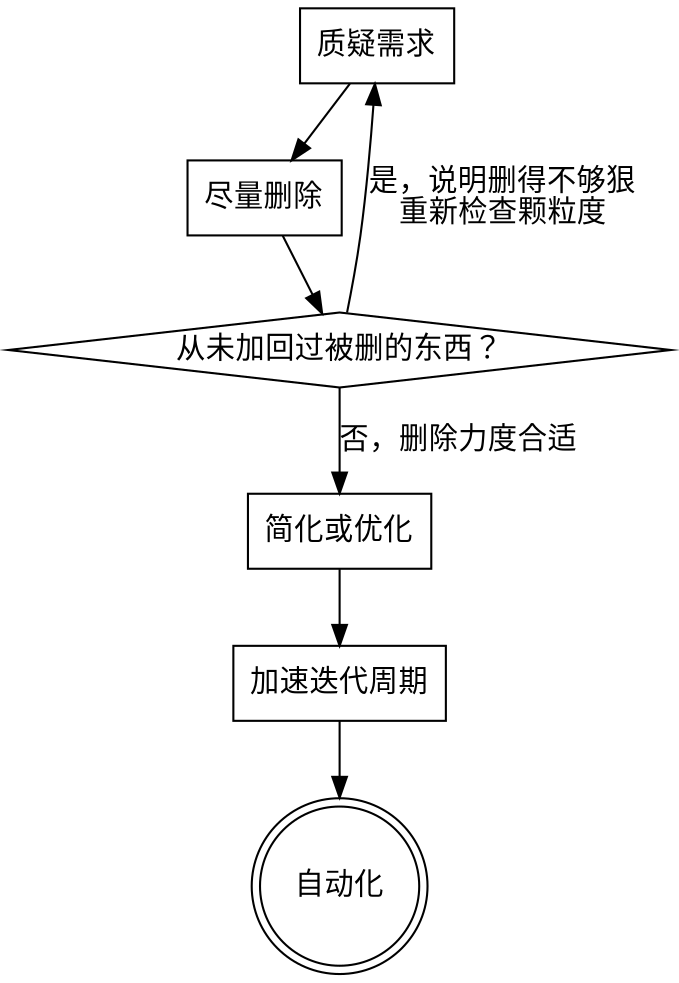

# 第一性原理 + 五步工作法

## Overview

Elon Musk 在多次采访中描述过他在 SpaceX/Tesla 使用的工程方法论（常被称为 "the algorithm"）。核心主张：先用第一性原理把问题拆解到不可再分的事实层面，再按固定顺序执行五个步骤，避免在错误的需求或流程上做优化——优化一个本不该存在的东西，是最常见也最隐蔽的浪费。

这个 skill 是一个通用思维框架，不是产出具体交付文档的业务流程。它靠对话逐步引导用户思考，**不强制产出文件**；只有用户主动要求时，才把结论落成一份简短的 Markdown 清单。

## 核心原则：先拆解，再优化

第一性原理要求：不靠类比、先例或"我们一直这么做"来做决策，而是把问题拆到物理/业务事实的最小单元，追问"这件事本质上要解决什么问题"，而不是"这个功能/方案应该长什么样"。

在动手做任何删除、简化、加速或自动化之前，先确认已经拆到了本质层面——如果讨论还停留在"这个字段应该叫什么"这种表面问题，说明还没有拆解到位，需要往上追问一层。

## 五步（软件语境版）

### 1. 质疑需求 Question the Requirement

- 每一条需求都必须能追溯到一个具体的人/角色（产品负责人、真实用户、合规要求），而不是"大家都这么觉得"或"业界最佳实践"。
- 尤其警惕"资深工程师/技术负责人"自己提出的需求——他们最容易把实现手段包装成需求本身（例如"我们需要一个通用配置中心"其实只是"这一个开关需要能改"）。
- 追问句式："如果不做这件事，最坏的后果具体是什么？"如果答不出具体、可验证的后果，这条需求大概率是可以删除或推迟的。

### 2. 尽量删除 Try to Delete

- 先尝试整体删除这个功能/字段/表/接口/审批流程，而不是先想着怎么优化它。
- 检验标准：如果你从来没有把删掉的东西加回来过，说明删得不够狠（预期至少 10% 的删除最终需要恢复，一次都没恢复过反而说明删除力度不够）。
- 常见目标：过度设计的抽象层、"以防万一"加的配置项、没有明确负责人的中间状态/中间表、从未被实际调用的兼容代码或降级分支。

### 3. 简化或优化 Simplify or Optimize

- 必须在完成删除之后才做这一步——优化一个本不该存在的流程，是最常见的浪费形式。
- 简化优先于优化：先让接口/数据结构/流程本身变简单，而不是让复杂的东西跑得更快。

### 4. 加速迭代周期 Accelerate Cycle Time

- 缩短"改动 → 反馈"的时间：更小的任务拆分、更快的验证方式（单测、预览、灰度发布），呼应仓库里其他 skill 已有的"增量模式"思路。
- 前提：必须排在前三步完成之后再做，否则只是更快地把错事做完。

### 5. 自动化 Automate

- 最后一步才做自动化。过早自动化一个还没被删除或简化的流程，只会把浪费固化下来，让它更难被发现和移除。
- 典型场景：把人工核对变成脚本校验、把手动同步变成 CI 检查（例如 `prototype-generator/scripts/validate.py` 这类"人工核对 → 脚本自动校验"的先例）。

## 使用方式（对话引导）

- 一次只问一个问题，不要在一条消息里堆多个追问。
- 每一步的追问要具体到用户当下的项目/需求，禁止使用空泛的模板句子（例如不要问"这个需求必要吗？"，而要问"这条'必须支持批量导入'的需求，是哪个角色提出的？如果这个季度不做，谁会因此受影响？"）。
- 如果用户在中途已经能明确判断某一步的结论，允许跳过剩余追问，直接进入下一步。
- 结束时口头总结本轮结论：保留了什么、删除了什么、后续在迭代速度和自动化上的建议。不强制写文件；只有用户主动要求落盘时，才生成一份简短的 Markdown 清单。

## 与其他 skill 的关系

本 skill 可以作为 `data-module-design`、`prototype-generator`、`restful-api-design` 在各自需求扫描阶段（Step 1）之前的可选前置引导——当这些 skill 面对的需求边界还不清晰时，可以先用这里的五步法过一遍。目前这三个 skill 的文件并未修改，是否接入留待后续按需再做。

## Process Flow

## Question Rule

一次只问一个问题；追问必须具体到用户当前的项目/需求，禁止空洞的模板句子。
